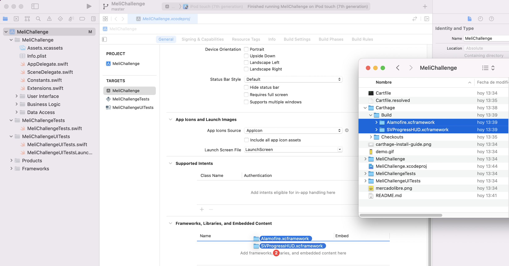

# MeliChallenge

This is an iOS app that uses a couple of MercadoLibre‘s API endpoints, developed as part of their interview process. It uses Carthage as a dependency manager.

## Instalation

1. Get Carthage by running `brew install carthage`
1. Clone the project by running `git clone https://github.com/sgoycoechea/MeliChallenge`
1. Install the dependencies by running `carthage update --use-xcframeworks --platform iOS`
1. Drag and drop the Alamofire and SVProgressHUD folders from Carthage/Build into Xcode, in the "Frameworks, Libraries, and Embedded Content" section of the main target. This is shown in the next image.

## Demo

The following video shows how the app works.

